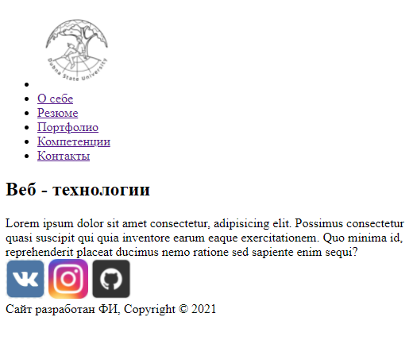
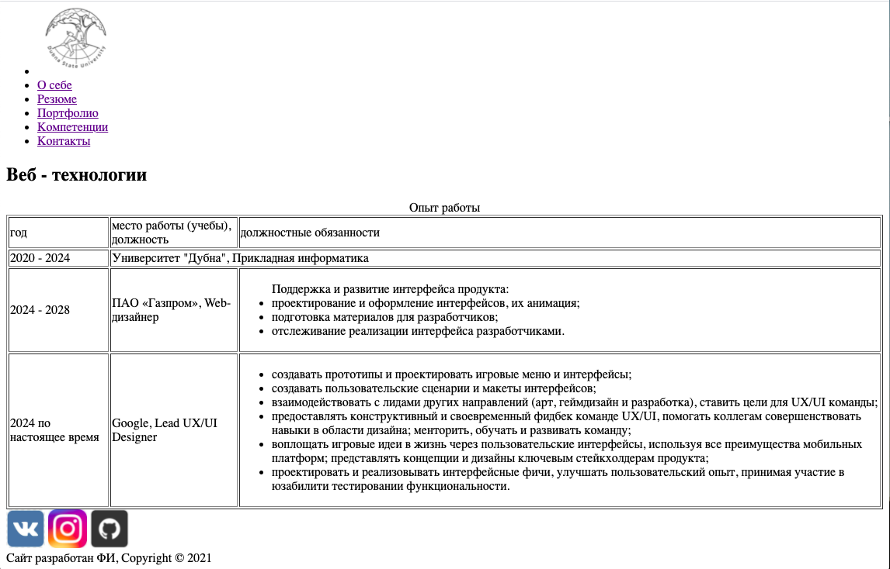
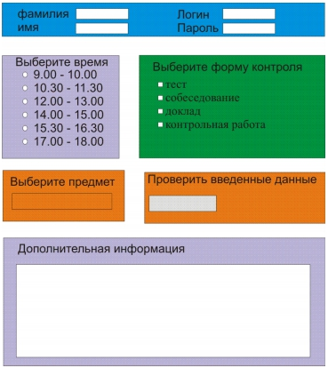

## Задание


_Создать макет html-страницы для персонального сайта (сохраните как example.html).
навигация (меню):_
+ логотип(является ссылкой на главную страницу),
+ о себе(главная),
+ резюме,
+ запись на аттестацию;
+ шапка (логотип-ссылка, меню);
+ основное содержимое (заголовок и случайный текст);
+ подвал:
```text
сайт разработан ФИ, Copyright © 2023,
иконки социальных сетей
```


_Используя макет создать остальные страницы.
На главной странице (index.html)  разместить информацию:_
kseniaveselovaa/task1
+ Фамилия И.О. студента
+ номер группы
+ фото (можно использовать любое изображение)
+ название и ссылка на сервер своего ВУЗа (можно на любой ресурс)
+ небольшой рассказ о себе (можно использовать случайный текст)


Создать страницу "Резюме", вид в браузере:


_Страница "Запись на аттестацию" должна содержать форму со следующими полями:_

+ Фамилия
+ Имя
+ Логин
+ Пароль
+ Выбор предмета (выпадающий SELECT, не менее 4)
+ Выбор времени (с помощью radio, не менее 4)
+ Форма контроля (с помощью checkbox: тест, собеседование, доклад, контрольная работа)
+ Дополнительная информация (TEXTAREA)
+ Кнопка для отправки данных.
+ 
Пример анкеты (для задания 1 использовать стили не нужно):
